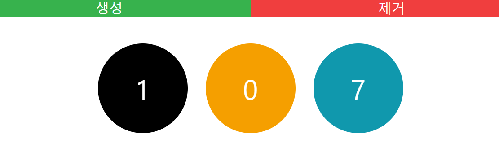

# react-tutorial-redux-counter
[](https://github.com/greatfarmer)

Study React!



## Progress
- Chapter 12 | 2018-08-20
- Chapter 13 | 2018-08-20 ~ 21

## Quick Start
### To run locally:
```
git clone https://github.com/greatfarmer/react-tutorial-redux-counter.git
cd react-tutorial-redux-counter
yarn install
yarn start
```

## Reference
- [리액트를 다루는 기술](http://www.gilbut.co.kr/book/bookView.aspx?bookcode=BN002044&page=1&TF=T), 김민준, 길벗 (2018)
